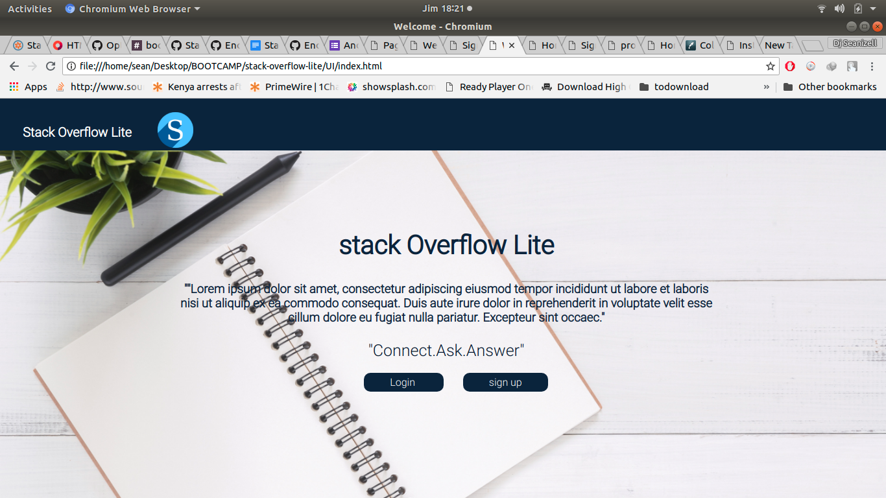

# STACK OVERFLOW LITE 
## Project Overview
### StackOverflow-lite is a platform where people can ask questions and provide answers. 


#### By ****Enock OMONDI****

## Requirements
* Browser
* Good internet connection

## How to use
* Open the site - link [here]()
* Create an account if you are new or login to application
* Create profile 
* Post a question
* Search for different questions
* answer questions to different questions.

## Technologies used
* html/css- Used for-frontend


###### Deployment
* not yet 

## For developers view the specifications

### Installing & testing
```
Clone  from my github(https://github.com/Enockkenya/stack-overflow-lite/tree/features)
```
```
Cd to the UI directory and open index.html using your favourite browser
```

### Requirements
* PC


### KNOWN BUGS
- all functionalities not implimented

### Meta
Incase of any queries, email me at -(djseanizellkenya@gmail.com)
<br>
Github - [Enock OMONDI](https://github.com/Enockkenya)

### License
This is an opensource software therefore the license is [MIT](https://choosealicense.com/licenses/mit/)
<br>
Copyright (c) 2018 